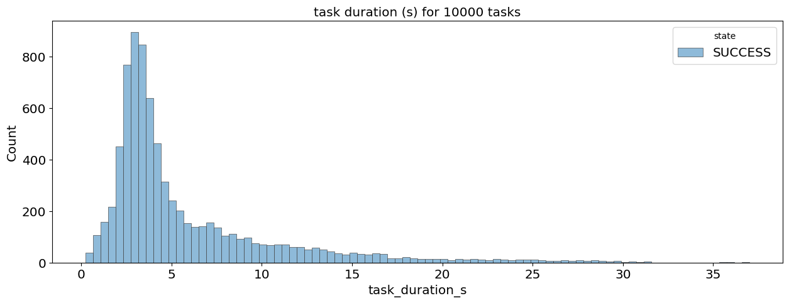

# chatgpt-poc
A POC to parse specific attributes from a prompt using [openai](https://platform.openai.com/overview). The application utilizes a [celery task queue](https://docs.celeryq.dev/en/stable/) to schedule api calls and provides an [analysis notebook](https://git.zoominfo.com/data-strategy/ChatGPT-POC/blob/go-fast/notebooks/batch_completion_analysis.ipynb) to evaluate general batch performance.

### Pipeline performance testing

*- service rated at 60rpm*
| records tested | success | failed | test duration | tasks per min | concurrency | optimal |
| --- | --- | --- | --- | --- | --- | --- |
| 1K | 994 | 6 | 1.4K s | 32.4 | 8 |  |
| 10K | 10K | 0 | 8296 s | 72.3 | 4 | * |
| 10K | 10K | 0 | 10K s | 59.7 | 6 | |
| 10K | 1229 | 8771 | 1.5K s | 47 | 8 |  |

### Installation guide

**Module setup**
1. `python3 -m venv .env` and `pip3 install --upgrade pip` 
2. activate the environment
4. `pip3 install -e .`

**Celery worker & task monitoring setup**
- ensure running services: `postgresql` and `rabbitmq-server`
- `app`: `python3 -m app` as a seperate screen
- celery `flower`: `celery -A celery_template flower --port=5566 --loglevel=INFO` as start task monitoring instance as a seperate screen

**Jupyter kernel setup**
1. `jupyter kernelspec uninstall .example_env` - remove existing kernels called .example_env
2. `python -m ipykernel install --user --name=.example_env`- install new kernel

**Testing**
1. `pytest -v`
2. `pytest -v .\tests\scripts\some_test.py -k 'some_pattern'`

References
1. openai
    - [API reference](https://platform.openai.com/docs/api-reference/completions/create)
2. celery
    - [Celery Distributed Task Queue](https://docs.celeryq.dev/en/stable/)
3. [Exponential](https://aws.amazon.com/blogs/architecture/exponential-backoff-and-jitter/) backoff & jitter
